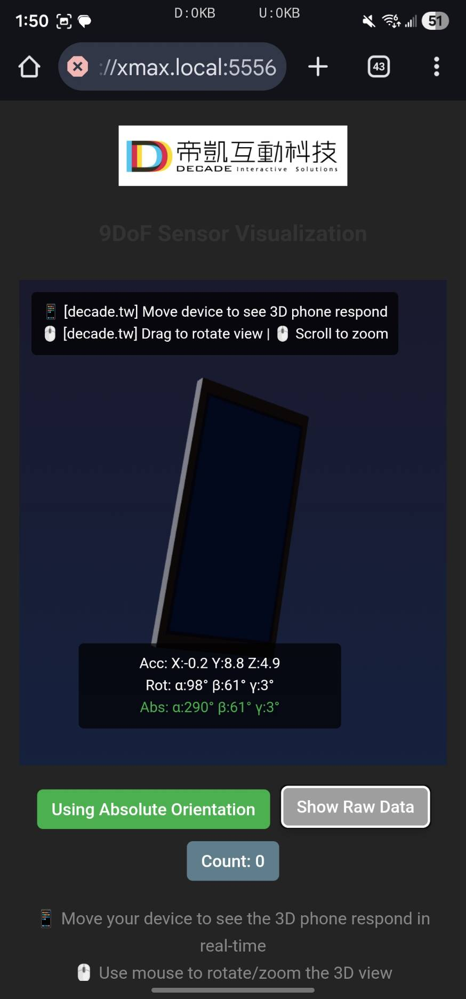

# 9DoF calc rotation with gravity effect

### 9DoF Unit

- Accelerometer (m/s²): Accel_X: 0.15, Accel_Y: -0.02, Accel_Z: 9.81 (Detects linear motion/gravity)
- Gyroscope (rad/s or deg/s): Gyro_X: 0.01, Gyro_Y: -0.03, Gyro_Z: 0.005 (Detects angular velocity)
- Magnetometer (Gauss or microTesla): Mag_X: 25, Mag_Y: -10, Mag_Z: 40 (Detects magnetic field for heading)

### Screenshot

## nodejs + react
This template provides a minimal setup to get React working in Vite with HMR and some ESLint rules.

Currently, two official plugins are available:

- [@vitejs/plugin-react](https://github.com/vitejs/vite-plugin-react/blob/main/packages/plugin-react) uses [Babel](https://babeljs.io/) (or [oxc](https://oxc.rs) when used in [rolldown-vite](https://vite.dev/guide/rolldown)) for Fast Refresh
- [@vitejs/plugin-react-swc](https://github.com/vitejs/vite-plugin-react/blob/main/packages/plugin-react-swc) uses [SWC](https://swc.rs/) for Fast Refresh

## Expanding the ESLint configuration

If you are developing a production application, we recommend using TypeScript with type-aware lint rules enabled. Check out the [TS template](https://github.com/vitejs/vite/tree/main/packages/create-vite/template-react-ts) for information on how to integrate TypeScript and [`typescript-eslint`](https://typescript-eslint.io) in your project.
